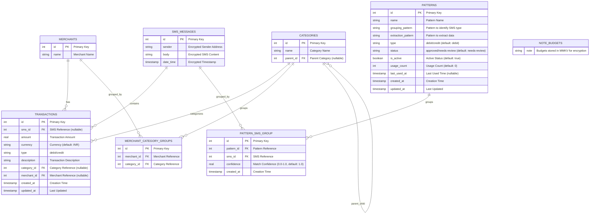

# Rose Wallet Database ERD

## Mermaid Entity Relationship Diagram



## Database Schema Overview

### Core Tables

1. **SMS_MESSAGES** - Stores encrypted SMS messages from banks (minimal)
2. **MERCHANTS** - Merchant information
3. **CATEGORIES** - Hierarchical transaction categories
4. **MERCHANT_CATEGORY_GROUPS** - Many-to-many relationship between merchants and categories
5. **TRANSACTIONS** - Financial transactions (SMS-parsed or manual)
6. **PATTERNS** - SMS parsing patterns
7. **PATTERN_SMS_GROUP** - Links SMS messages to patterns (many-to-many relationship)

### External Storage

- **BUDGETS** - Stored in MMKV for better performance and encryption

### Key Relationships

- **SMS → Transactions**: One SMS can contain multiple transactions (nullable)
- **Merchants → Transactions**: One merchant can have many transactions
- **Categories → Transactions**: One category can have many transactions
- **Merchants ↔ Categories**: Many-to-many via MERCHANT_CATEGORY_GROUPS
- **Categories → Categories**: Self-referencing for hierarchical categories
- **Patterns ↔ SMS**: Many-to-many via PATTERN_SMS_GROUP (one pattern can match multiple SMS, one SMS can match multiple patterns)
- **Budgets**: Stored in MMKV (not in database)

### Data Flow

```
SMS Message → Pattern Discovery → Pattern-SMS Grouping → Transaction Creation → Category Assignment → Budget Tracking
```

1. **SMS arrives** → Stored in `sms_messages`
2. **Pattern discovery** → Analyzes SMS content and creates patterns
3. **Pattern-SMS grouping** → Links SMS to patterns via `pattern_sms_group`
4. **Transaction created** → Stored in `transactions` with reference to SMS
5. **Category assigned** → Links transaction to categories via `merchant_category_groups`
6. **Budget tracking** → Updates `budgets` spent amounts

### Features

- **Live Queries**: All tables support real-time updates
- **Type Safety**: Full TypeScript support with inferred types
- **Relationships**: Proper foreign key constraints
- **Timestamps**: Automatic created_at/updated_at tracking
- **Soft Deletes**: is_active flags for patterns and budgets
- **Hierarchical Categories**: Parent-child relationships for category organization
