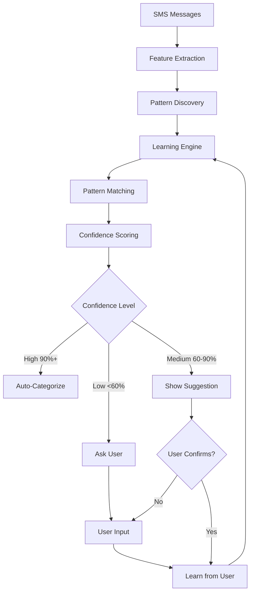
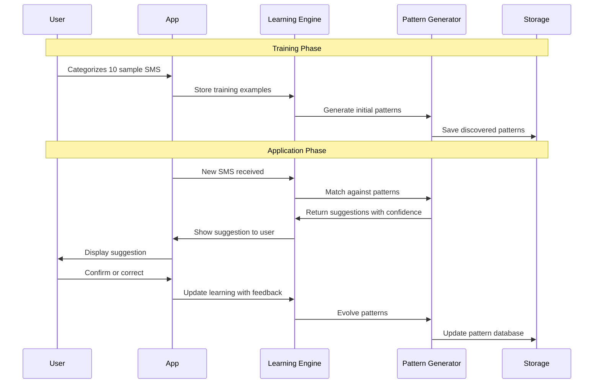
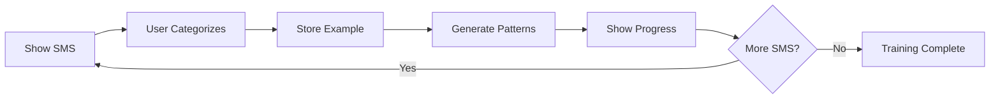
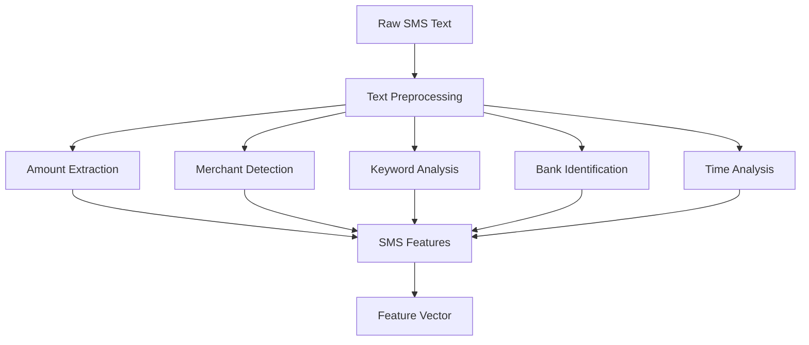
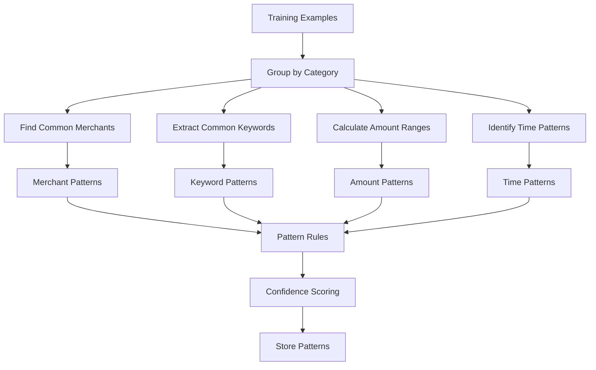
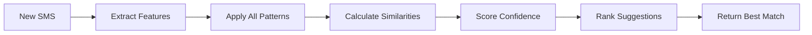
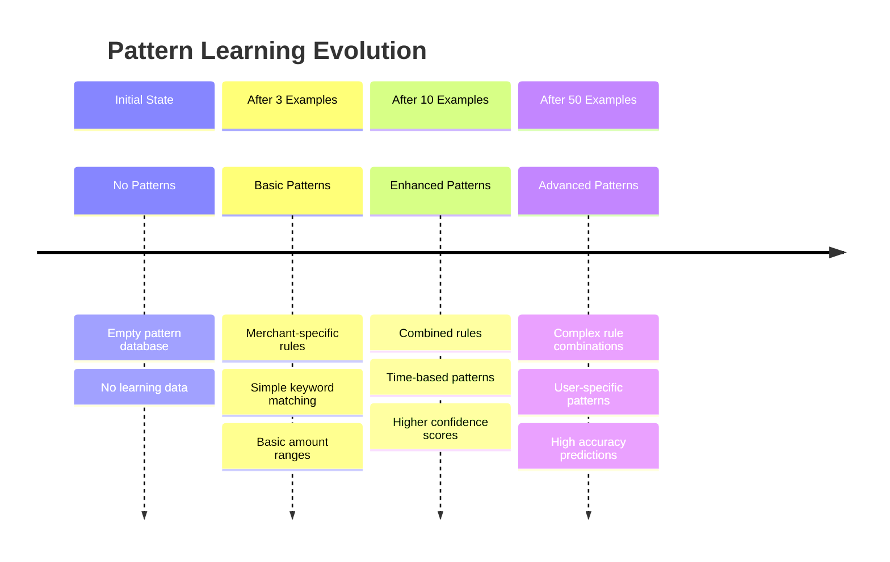
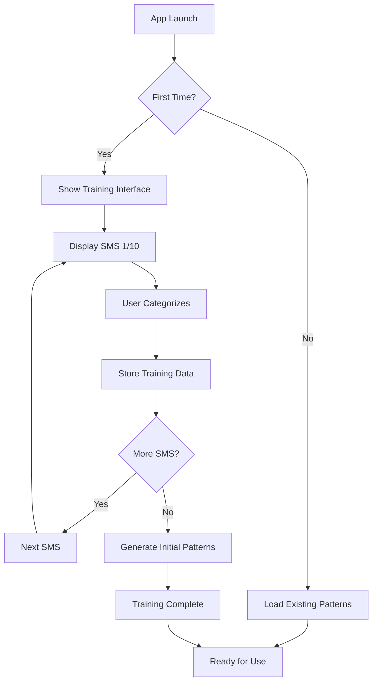
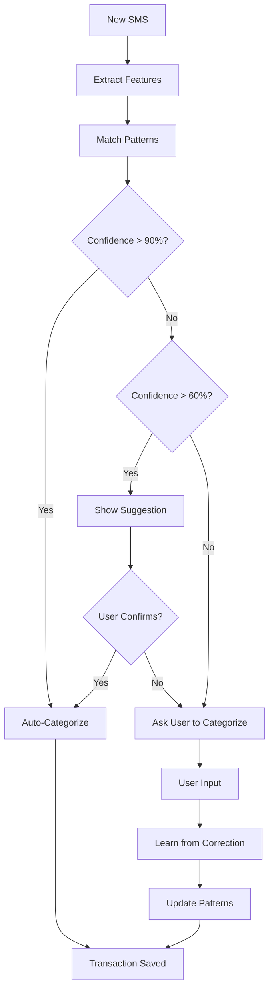
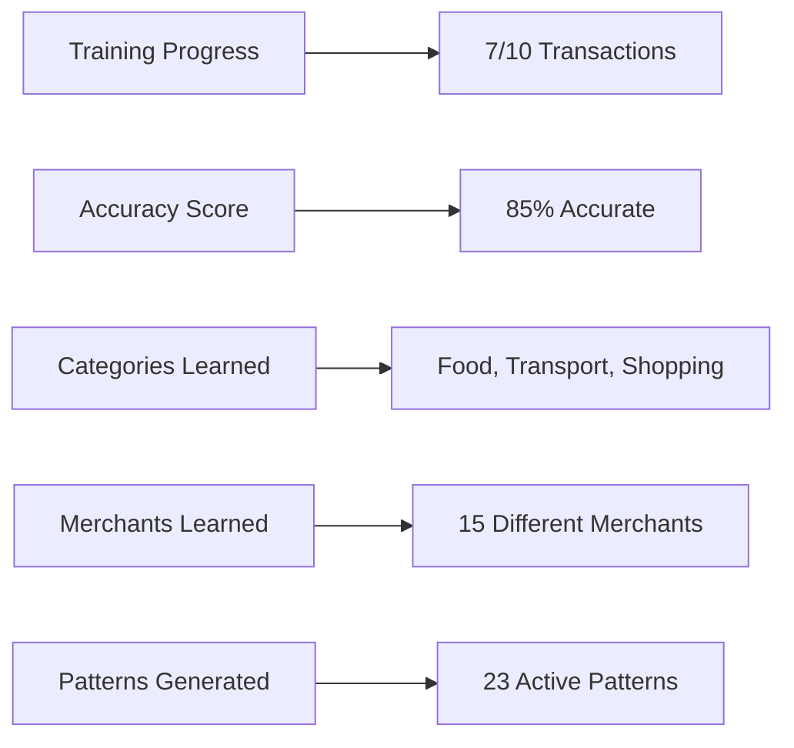

# 📚 Rose Expense Tracker - Intelligent SMS Learning System Documentation

## 🎯 Overview

The Rose Expense Tracker implements an **intelligent SMS learning system** that automatically categorizes financial transactions by learning from user behavior. Instead of relying on hardcoded patterns, the system dynamically generates and evolves patterns based on user interactions, creating a personalized and adaptive expense tracking experience.

## 🧠 Core Concept

The system treats SMS categorization as a **machine learning problem with human-in-the-loop training**. Users teach the app by categorizing sample transactions, and the app learns to automatically categorize similar transactions in the future.

## 🏗️ System Architecture



## 🔄 Learning Process Flow



## 🎮 Gamification Elements

### Training Interface


### Achievement System
- **Foodie**: Categorized 10 food transactions
- **Bank Master**: Handled SMS from 5 different banks
- **Pattern Detective**: Correctly identified 20 similar transactions
- **Speed Learner**: Trained 10 transactions in under 2 minutes

## 🔍 Feature Extraction Process



### Extracted Features
- **Basic Info**: Amount, Bank, Sender
- **Text Analysis**: Keywords, Merchant name, Location
- **Patterns**: Amount ranges, Time of day, Day of week
- **Context**: Transaction type indicators

## 🧩 Pattern Discovery Algorithm



### Pattern Types Generated

1. **Merchant-Specific Patterns**
   - Rule: `merchant === "SWIGGY"`
   - Confidence: 95%
   - Category: Food & Dining

2. **Keyword-Based Patterns**
   - Rule: `keywords.includes("debited") && keywords.includes("at")`
   - Confidence: 80%
   - Category: Online Transaction

3. **Amount Range Patterns**
   - Rule: `amount >= 150 && amount <= 350`
   - Confidence: 70%
   - Category: Food & Dining

4. **Combined Patterns**
   - Rule: `merchant === "SWIGGY" && amount >= 100 && amount <= 500`
   - Confidence: 90%
   - Category: Food & Dining

## 🎯 Pattern Matching & Confidence Scoring



### Confidence Calculation
- **Exact Merchant Match**: 95% confidence
- **Keyword Similarity**: 60-80% confidence
- **Amount Range Match**: 50-70% confidence
- **Combined Patterns**: 80-95% confidence

## 📈 Learning Evolution



## 🎮 User Experience Flow

### First-Time Setup


### Daily Usage


## 🏆 Gamification Features

### Progress Tracking


### Achievement System
- **Learning Milestones**: Track training progress
- **Accuracy Achievements**: Reward high accuracy
- **Coverage Achievements**: Reward pattern diversity
- **Speed Achievements**: Reward quick learning

## 🔧 Technical Implementation

### Data Structures

#### Training Example
```typescript
interface TrainingExample {
  smsFeatures: SMSFeatures
  userClassification: UserClassification
  timestamp: Date
  confidence: number
}
```

#### Pattern Rule
```typescript
interface PatternRule {
  key: string
  rule: string
  category: string
  confidence: number
  examples: number
  lastUpdated: Date
}
```

#### SMS Features
```typescript
interface SMSFeatures {
  amount: number
  bank: string
  merchant: string
  keywords: string[]
  amountRange: string
  timeOfDay: string
  dayOfWeek: string
}
```

### Learning Algorithm

#### Pattern Discovery
1. **Group Training Data** by category
2. **Find Common Elements** within each group
3. **Generate Rules** based on common patterns
4. **Calculate Confidence** based on example count
5. **Store Patterns** for future matching

#### Pattern Evolution
1. **Monitor New Examples** for pattern updates
2. **Adjust Confidence** based on accuracy
3. **Expand Rules** when new data fits existing patterns
4. **Create New Patterns** for novel combinations
5. **Retire Patterns** with low accuracy

## 🎯 Benefits of This Approach

### For Users
- **Personalized**: Learns individual spending patterns
- **Engaging**: Gamified learning experience
- **Accurate**: Gets better with more data
- **Transparent**: Shows why suggestions were made

### For the System
- **Scalable**: Works with any SMS format
- **Adaptive**: Handles new banks and merchants
- **Self-Improving**: Continuously learns and evolves
- **Maintainable**: No hardcoded patterns to maintain

## 🚀 Future Enhancements

### Advanced Learning
- **Machine Learning Models**: Implement ML algorithms
- **Cross-User Learning**: Learn from anonymized data
- **Predictive Analytics**: Predict spending patterns
- **Anomaly Detection**: Identify unusual transactions

### Enhanced Gamification
- **Social Features**: Compare with friends
- **Challenges**: Weekly categorization challenges
- **Rewards**: Points and badges system
- **Leaderboards**: Accuracy and speed rankings

## 🎮 Game-Like Training Interface

### Training Flow
```
┌─────────────────────────────────────┐
│ 🎯 Train Your Expense Tracker       │
│                                     │
│ SMS: "Rs.500 debited from A/c       │
│      XX1234 at SWIGGY"              │
│                                     │
│ Transaction Type: [Cash] [Online]   │
│ Category: [Food] [Transport] [Other]│
│ Merchant: [Swiggy] [Zomato] [Other] │
│                                     │
│ [Skip] [Save & Next]                │
└─────────────────────────────────────┘
```

### Progress Indicators
- **Progress Bar**: "You've trained 7/10 transactions"
- **Accuracy Score**: "Your app is 85% accurate!"
- **Achievements**: "Food Expert", "Bank Master", etc.
- **Quick Actions**: "Mark all similar as Food & Dining"

## 🧠 How the Learning Works

### Dynamic Pattern Generation
The patterns are **dynamically generated** based on user behavior and SMS content. This is what makes the system truly intelligent and adaptive.

#### Pattern Discovery Process
1. **Feature Extraction**: Extract key features from SMS
2. **Grouping**: Group similar transactions by category
3. **Pattern Finding**: Find common patterns within groups
4. **Rule Generation**: Create rules based on patterns
5. **Confidence Scoring**: Calculate confidence based on examples

#### Real Example of Learning
**Training Phase:**
1. User sees: "Rs.250 debited from A/c XX1234 at SWIGGY"
2. User categorizes: Transaction Type: "Online", Category: "Food & Dining"
3. App learns: "SWIGGY" + "debited at" = "Online Food & Dining"

**Application Phase:**
1. New SMS: "Rs.180 debited from A/c XX5678 at ZOMATO"
2. App thinks: "ZOMATO" is similar to "SWIGGY", "debited at" pattern matches
3. App suggests: "Online Food & Dining" with 85% confidence
4. User confirms, app learns: "ZOMATO" = "Food & Dining"

**Advanced Learning:**
1. After 10 food transactions, app learns: "debited at [FOOD_MERCHANT]" = "Food & Dining"
2. App can now categorize new food merchants automatically
3. Confidence increases as more examples are learned

This creates a **self-improving system** that gets smarter with each user interaction! 🚀

## 📊 Learning Metrics

### Success Indicators
- **Accuracy Rate**: Percentage of correct categorizations
- **Confidence Growth**: How confidence improves over time
- **Pattern Coverage**: Number of different patterns learned
- **User Engagement**: Time spent in training mode
- **Correction Rate**: How often users correct suggestions

### Gamification Metrics
- **Training Completion**: Percentage of users who complete training
- **Achievement Unlocks**: Number of achievements earned
- **Learning Speed**: Time to reach 80% accuracy
- **Pattern Diversity**: Number of unique patterns generated
- **User Satisfaction**: Feedback on learning experience

This intelligent learning system transforms expense tracking from a manual chore into an engaging, personalized experience that gets smarter over time! 🎯
